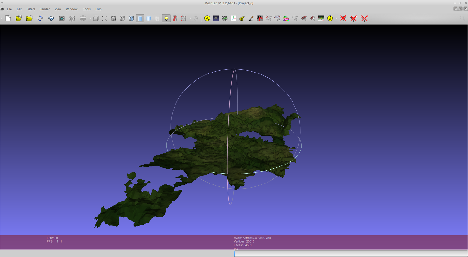
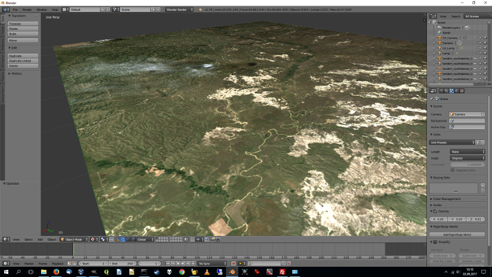
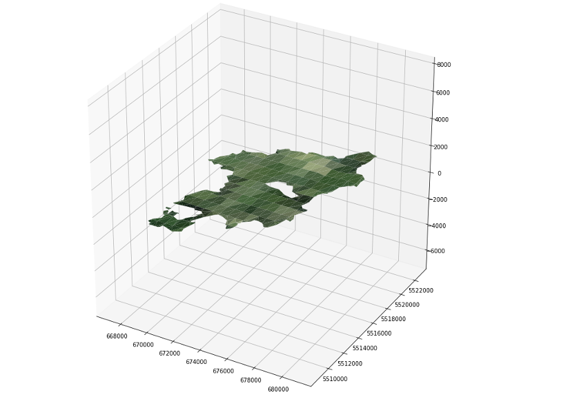

# geoTriMesh

geoTriMesh converts GIS data to colored 3D meshes (X3D).
The library is intended to help to bridge the gap between geospatial data and 3D modelling.

Installation:

	pip install geotrimesh

Usage:

	from geotrimesh import mesh

	elevation = mesh.ElevationMesh()
	elevation.generate_mesh(dem='srtm3.tif', orthophoto='bluemarble.tif', boundaries='osm.shp')

Options:

dem
| 	dem_nodata
| 	orthophoto
| 	orthophoto_nodata
| 	boundaries
| 	tiles_size
| 	tiles_bbox
| 	mesh_prefix
| 	mesh_path
| 	mesh_shapefile
| 	scale_xy
| 	z_exaggeration
| 	projection
| 	centering
| 	indexed_colors
| 	coloring_mode
| 	mesh_format

*Mesh of city of Pottenstein with 5x z-exaggeration, X3D, visualized in Meshlab*

*TanDEM-X (South Dakota demo data), X3D, visualized in Blender*

*Mesh of city of Pottenstein, Matplotlib/mplot3d output*

*Complete TOCOMEE dataset (crude resolution), visualized in Blender*

Download the complete TOCOMEE dataset (made with geoTriMesh) here: <http://www.flatpolar.org/tocomee.html>

