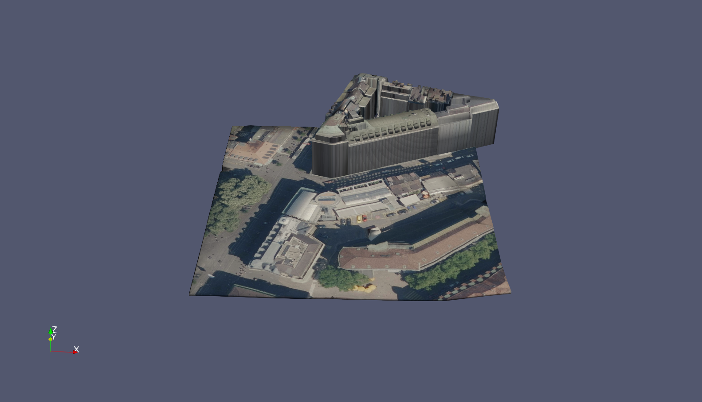
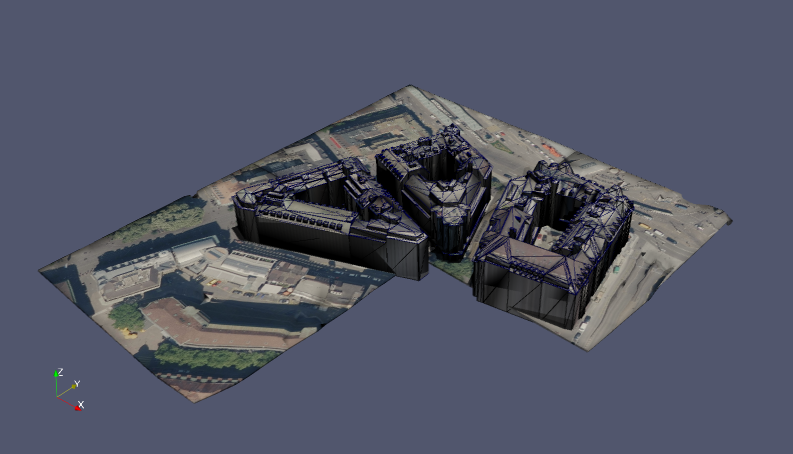
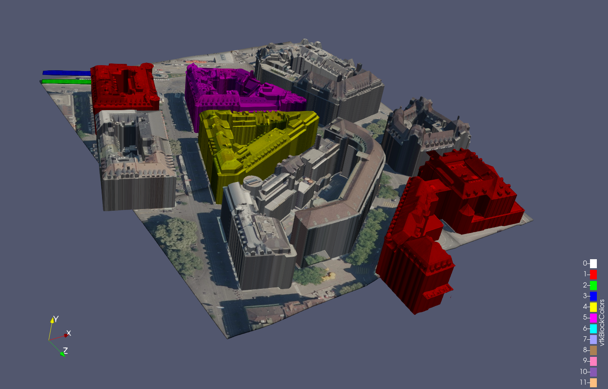

Generate sceneries from georeferenced 2D and 3D sources.

```python
from geotrimesh import GeoSceneSet

boundary = gpd.read_file(boundary_filepath).dissolve().explode(index_parts=True)
zurich = GeoSceneSet()

tilingscheme = GeoSceneSet.TilingScheme(boundary, dem_filepaths, height=32, width=32)
tilingscheme.gdf.to_file(Path(out_dirpath, "tiles.gpkg"))

zurich.terrain = GeoSceneSet.Terrain(
    out_dirpath=out_dirpath,
    filepaths=dem_filepaths,
    tiles=tilingscheme.tiles[0:4],
    boundary=boundary
)

zurich.buildings = GeoSceneSet.Features(
    "buildings",
    tilingscheme=tilingscheme,
    out_dirpath=out_dirpath,
    filepaths=buildings_filepaths,
    recombine_bodies=True,
    boundary=boundary,
    tiles=tilingscheme.tiles[0:4],
)

zurich.ortho = GeoSceneSet.Ortho(
    tilingscheme=tilingscheme,
    out_dirpath=out_dirpath,
    filepaths=ortho_filepaths,
    boundary=boundary,
    tiles=tilingscheme.tiles[0:4],
)


```




