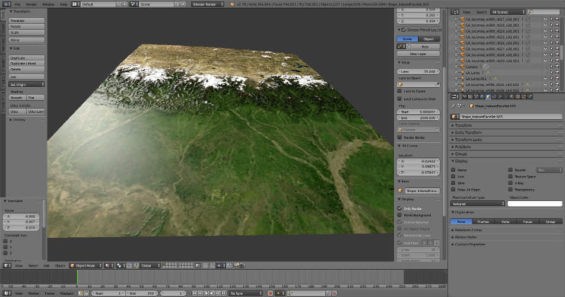
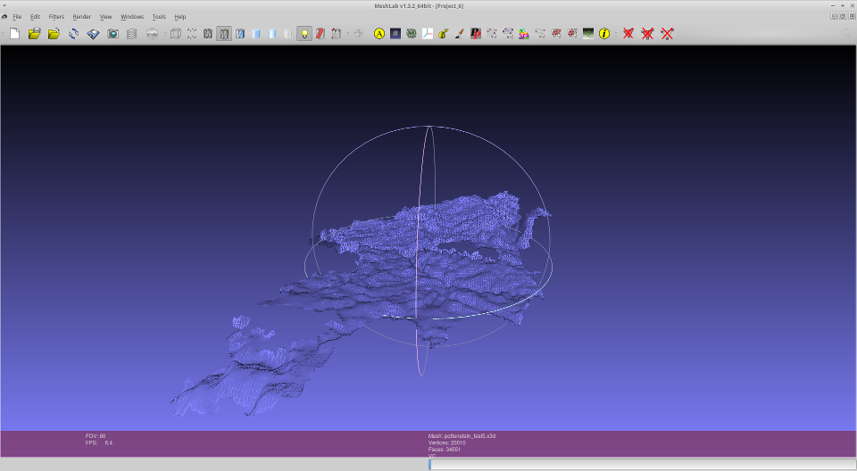
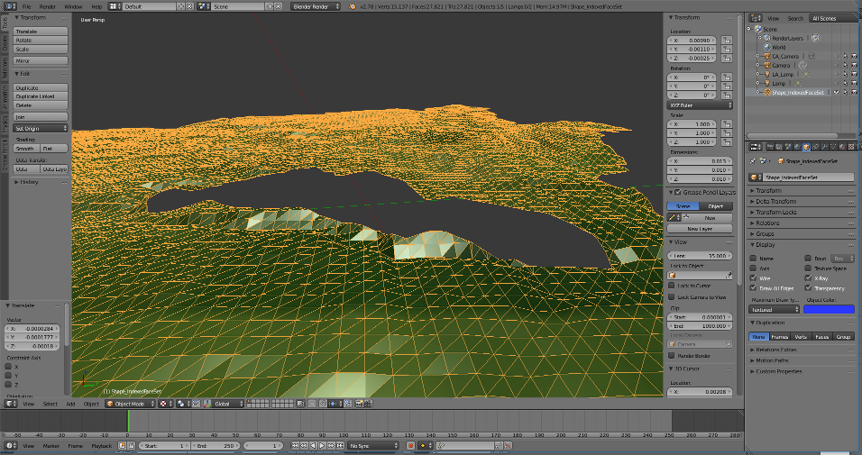
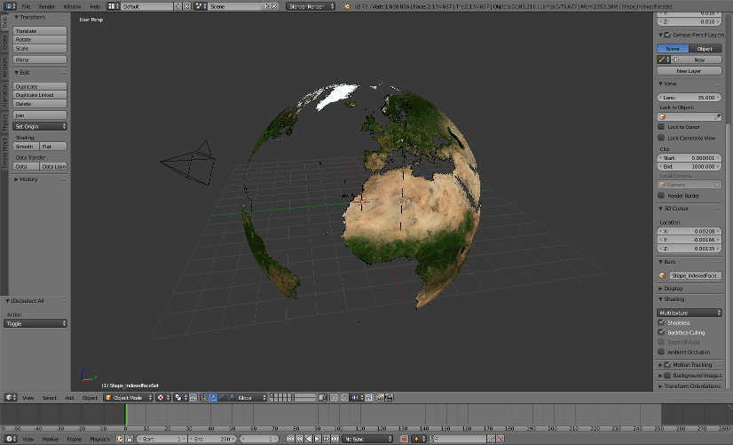

# geoTriMesh

Converts GIS data to colored 3D meshes (X3D)

Usage:

	from geotrimesh import mesh

	elevation = mesh.ElevationMesh()
	elevation.generate_mesh(dem='srtm3.tif', orthophoto='bluemarble.tif', boundaries='osm.shp', mesh_prefix='sample')

*Tile of the TOCOMEE dataset (visualized in Blender), created with geoTriMesh*

*Mesh of city of Pottenstein with 5x z-exaggeration  (visualized in Meshlab)*

*Detail mesh view*

*Complete TOCOMEE dataset (crude resolution), created with geoTriMesh

Options:

dem
| 	dem_nodata
| 	orthophoto
| 	orthophoto_nodata
| 	boundaries
| 	tiles_size
| 	tiles_bbox
| 	mesh_prefix
| 	mesh_path
| 	mesh_shapefile
| 	scale_xy
| 	z_exaggeration
| 	projection
| 	centering
| 	indexed_colors
| 	coloring_mode
| 	mesh_format
